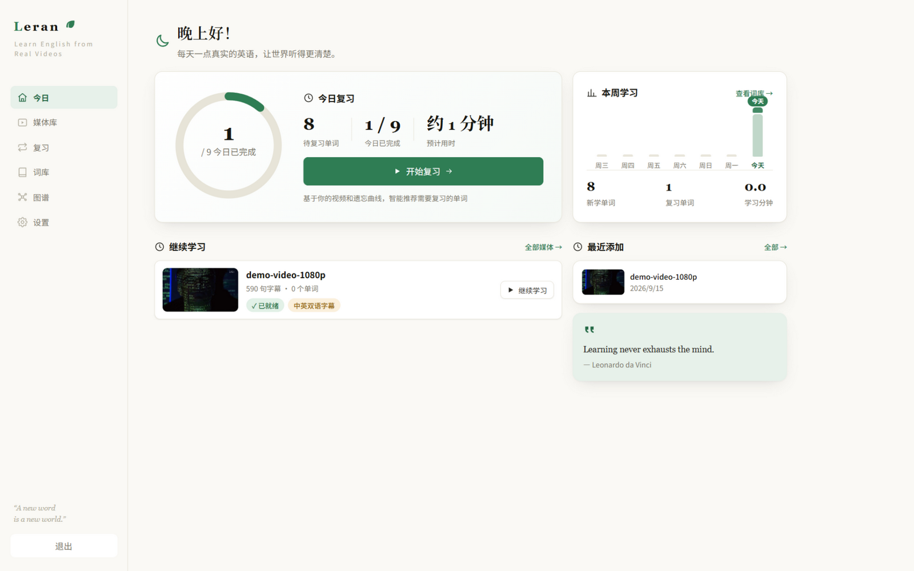
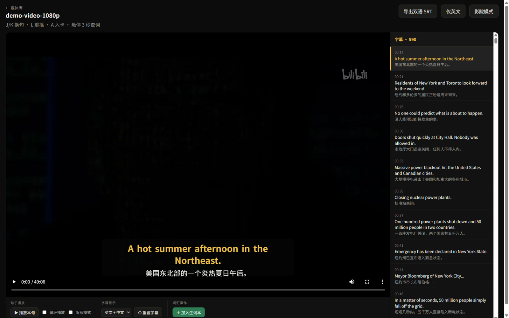
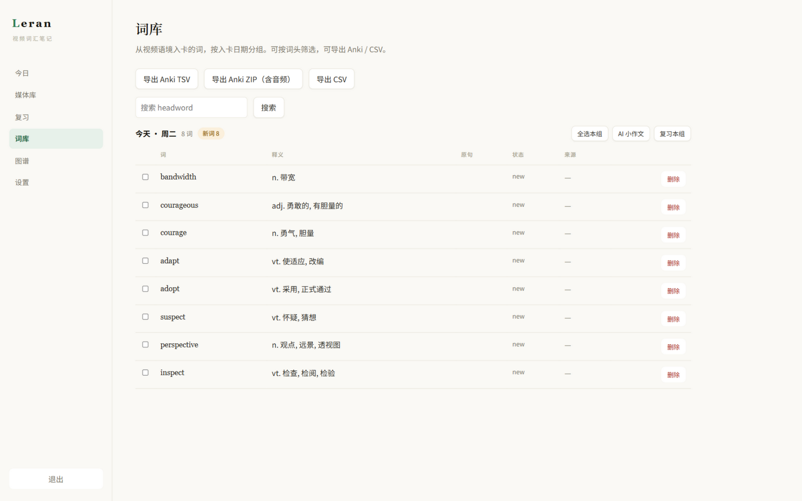
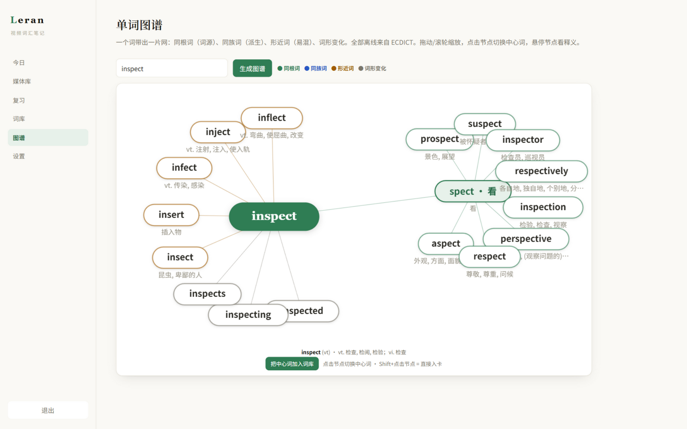
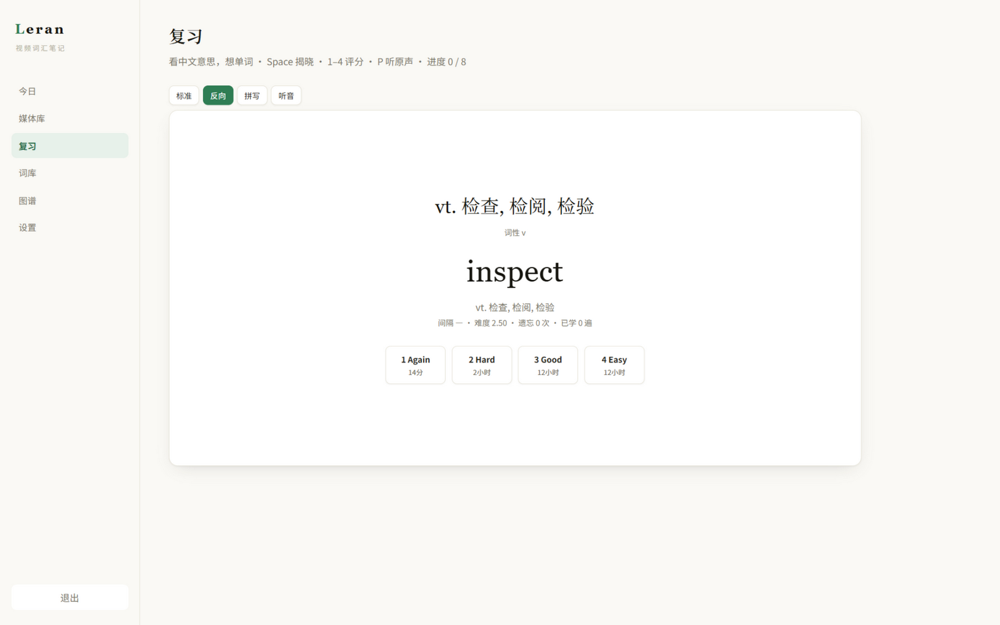
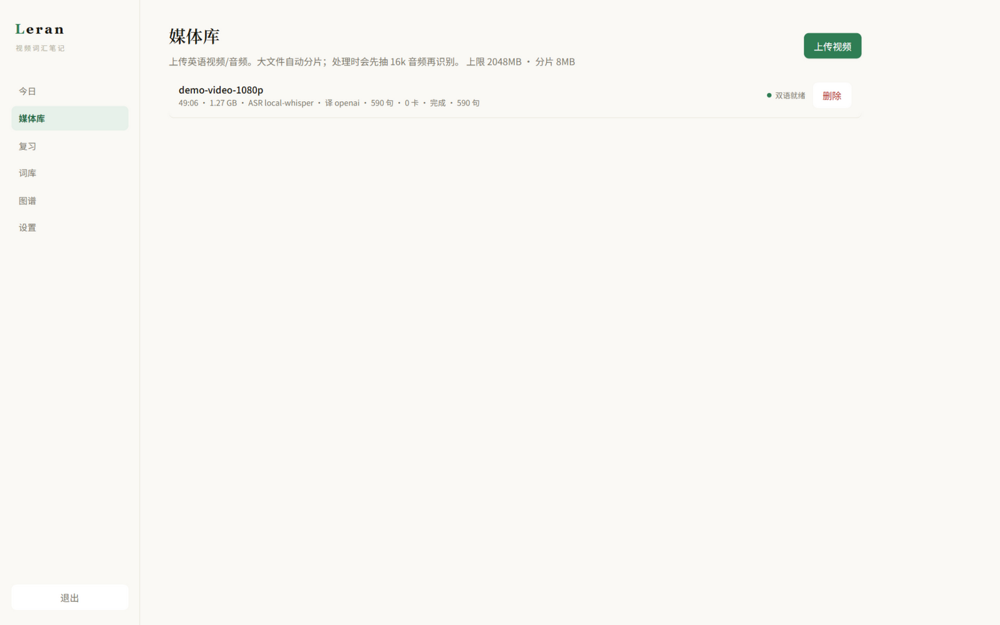

# WordReel

用真实英语视频学单词，并输出中英双语字幕。

设计文档：
- `docs/PRODUCT_DESIGN.md`
- `docs/OPEN_SOURCE_RESEARCH.md`

## 界面预览

| 今日（复习进度环 · 本周统计 · 继续学习） | 字幕工作台（双语字幕 · 悬停查词 · 点词入卡） |
|---|---|
|  |  |

| 词库（按日期分组 · 状态标签页 · AI 小作文 · 迷你复习） | 单词图谱（同根 / 同族 / 形近 / 词形） |
|---|---|
|  |  |

| 复习（四种模式 · 间隔预览） | 媒体库 |
|---|---|
|  |  |

## MVP 能力

- 注册 / 登录
- 上传视频 →（mock / OpenAI 兼容 / 本地 faster-whisper）ASR + 翻译流水线
- 字幕工作台：播放、当前句高亮、编辑中英、导出 SRT、**听写模式**、句循环
- 点词入卡（原句 + 时间点 + **音频切片**，需 ffmpeg）
- **整句收藏**：工作台「收藏本句」或按 `S`，整句 + 中文 + 时间点 + 音频入句库，可 SRS 复习、跳回视频
- 悬停查词：**离线 ECDICT**（340 万条 / ~0.1ms）→ 有道 → 百度翻译（可选 Key）→ LLM 深查
- 词库按日期分组：每组有进度统计、「复习本组」、**AI 小作文**（LLM 把当天新词写成带中文翻译的短文，可保存多篇）
- **句库**：按收藏日分组，跳回视频时间点，与词库共享 SRS / 复习本组
- **单词图谱**：输入一个词，放射状展开四组关系——同根词（内置拉丁/希腊词根表）、同族派生词、形近易混词（编辑距离）、词形变化；全部离线（ECDICT），点击节点换中心词
- SRS 复习（SM-2，Space / 1–4 / P 听原声）：**四种模式**（标准看词想义 / 反向看义想词 / 拼写 / 听音辨词），评分按钮显示下次间隔预览（Anki 式），Again 卡本轮末尾重现，结束有本轮统计；词库页支持「复习本组」只练某天收的词
- 词库导出：**Anki TSV / Anki ZIP（含音频）/ CSV**
- Provider 设置（mock / openai / local-whisper；查词兜底可另配百度翻译，AI 小作文走 Enrich 的 LLM）

默认 `mock` Provider：**无需 API Key** 即可跑通全流程（识别结果为演示台词，AI 小作文为演示文本）。

## 目录

```text
apps/api   FastAPI + SQLite
apps/web   React + Vite
data/      运行时生成：SQLite + 媒体文件
docs/      产品设计与调研
```

## 启动

### 1) API

```powershell
cd apps/api
python -m venv .venv
.\.venv\Scripts\Activate.ps1
pip install -r requirements.txt
python -m uvicorn app.main:app --host 127.0.0.1 --port 8000 --reload
```

### 2) Web

```powershell
cd apps/web
npm install
npm run dev
```

浏览器打开 http://127.0.0.1:5173  
注册一个账号（例如 `demo@leran.local` / `demo1234`）。

### 3) 试用路径

1. 媒体库 → 上传任意视频/音频文件（mock 只读文件名生成演示字幕）。
2. 进入工作台 → 等待「双语就绪」。
3. 悬停单词约 1 秒 → 查词卡（ECDICT 离线释义）→「入卡」；`A` 整句首词入卡；`S` 收藏本句到句库。
4. 「复习」页 Space 揭晓，1–4 评分；词库页可「复习本组」只练某天的词。
5. 词库页 →「AI 小作文」→ 用当天新词生成一篇带中文翻译的短文。
6. 导出双语 SRT / Anki ZIP（含音频，`wordreel_cards.tsv` + `card_*.mp3`）/ CSV。
7. 工作台勾选「听写模式」→ 听句输入英文 → 对照。

### 本地 Distil / Turbo（GPU 已打通）

模型：`deepdml/faster-whisper-large-v3-turbo-ct2`（Distil 同级速度）  
路径：`E:\leran-models\whisper\deepdml__faster-whisper-large-v3-turbo-ct2`（约 1.5GB）

```env
LOCAL_WHISPER_MODEL=distil
LOCAL_WHISPER_DEVICE=auto    # 有 CUDA 则 GPU float16，否则 CPU int8
LOCAL_WHISPER_VAD=false
LOCAL_WHISPER_DOWNLOAD_ROOT=E:\leran-models\whisper
```

**GPU 依赖：** `ctranslate2==4.4.0` + `nvidia-cudnn-cu12==8.9.7.29`（必须 cuDNN **8**，9 会缺 `cudnn_ops_infer64_8.dll`）。Provider 会自动 `add_dll_directory`。

**实测：** 13s 样本 GPU RTF ≈ 0.16（约 2s），CPU ≈ 0.4；经 API 全链路约 3s 出 3 句正确字幕。

### 真实 ASR / 翻译

- **云端：** 设置 → ASR/翻译 → `openai`，填 Key（可兼容 `base_url`），重传或重跑。
- **本地：** 设置 → ASR → `local-whisper`，模型填 `base`/`small`/…  
  需先：`pip install faster-whisper`（apps/api venv），并保证本机有 ffmpeg。

### ffmpeg（音频切片）

入卡时会截约 2–4 秒原声（复习可听、Anki ZIP 会打包）。  
Windows 可用 winget：`winget install Gyan.FFmpeg`，然后在 `apps/api/.env` 写：

```env
FFMPEG_PATH=C:\...\ffmpeg.exe
```

### 查词：离线 ECDICT + 百度兜底

悬停/选词查词顺序：**我的单词卡 → 缓存 → ECDICT（离线 ~0.1ms）→ 有道 → 百度翻译（需 Key）→ LLM（仅 `deep=1` 深查）**。

- **ECDICT 离线库**：340 万词条，来自 [skywind3000/ECDICT](https://github.com/skywind3000/ECDICT)
  release `ecdict-sqlite-28.zip`（解压约 850MB）。本机放在 `E:\leran-models\ecdict\ecdict.db`，
  在 `apps/api/.env` 配置：`ECDICT_DB_PATH=E:\leran-models\ecdict\ecdict.db`。
  未配置时默认找 `data/ecdict.db`；文件不存在会自动跳过这一层。
- **百度翻译兜底**（官方接口，稳定）：在[百度翻译开放平台](https://fanyi-api.baidu.com)注册，
  设置页「查词兜底（在线）」填 APP ID + 密钥。标准版无需认证、**每月 5 万字符免费**（QPS=1）；
  个人认证后（高级版）每月 100 万字符。只有 ECDICT/有道都查不到才调用，消耗极低；
  建议在百度控制台开启「免费额度用量提醒」，防止超额后按量扣费。

### AI 小作文（按天串词成文）

词库页按入卡日期分组，每组可展开「AI 小作文」：LLM 把当天收录的新词串成一篇
90–140 词的英文短文（目标词加粗、文末附中文翻译），在语境中巩固记忆。
生成即保存（SQLite `stories` 表），一天可写多篇，可删除。

- 入口：词库页 → 某天分组 → 「AI 小作文」→ 生成
- 依赖「设置 → 释义 Enrich」的 LLM 配置（OpenAI 兼容：填 Key + Base URL，
  DeepSeek / 智谱 GLM 等均可）；未配置时输出 mock 演示文本

## API 摘要

- `POST /api/auth/register` `POST /api/auth/login` `GET /api/auth/me`
- `GET/POST /api/media/upload` `GET /api/media/{id}` `GET /api/media/{id}/segments`
- `GET /api/media/{id}/export?format=srt&lang=bilingual`
- `POST /api/cards/from-segment` `GET /api/cards/{id}/audio`
- `GET /api/review/queue` `POST /api/review/{card_id}`
- `GET /api/export/cards.csv` `GET /api/export/anki.tsv` `GET /api/export/anki.zip`
- `GET/PUT /api/settings/providers`
- `GET/POST /api/stories` `DELETE /api/stories/{id}`（AI 小作文，走 Enrich LLM 配置）
- `GET /api/graph/word?word=...`（单词知识图谱，离线）

## 大文件 / 一集剧（约 45 分钟）

- 默认上限 **2048MB**（`.env` 可改 `MAX_UPLOAD_MB`）
- **>8MB 自动分片上传**，媒体库有进度条
- 流水线：**抽 16k 音频 → 按约 10 分钟切片 ASR → 窗口化批量翻译**
- `<video>` 支持 **HTTP Range**
- 进度字段：识别 3/5 段、翻译 N 句 等

### 45 分钟体验预期

| Provider | 大约耗时 | 说明 |
|----------|----------|------|
| mock | 秒级 | 演示：约 1000 句，铺满 45 分钟 |
| local-whisper `base` | CPU 约 15–40 分钟；GPU 更快 | 首次需下载模型 |
| OpenAI whisper | 约 3–10 分钟 + 翻译 | 按分钟计费；自动切片防 25MB 限制 |

```env
MAX_UPLOAD_MB=2048
CHUNK_SIZE_MB=8
EXTRACT_AUDIO_FOR_ASR=true
ASR_CHUNK_MINUTES=10
TRANSLATE_BATCH_SIZE=16
FFMPEG_PATH=...
ECDICT_DB_PATH=...
```

实测（本机 mock + ffmpeg）：45:00 音频 → 切 5 段识别 → **1039 句**，时间轴跨约 **44.9 分钟**，Range 可用。

## 说明

- MVP 使用 SQLite + 本地磁盘；生产可换 Postgres / S3（见设计文档）。
- 流水线当前在 API 进程内起线程执行，后续可拆 Worker。
- 词级时间戳：mock 会生成；OpenAI Whisper `verbose_json` 若返回 words 会写入。
