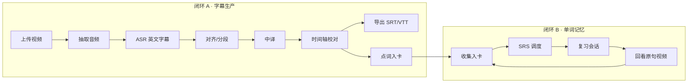

# Leran — 产品设计文档

> 用真实英语视频学单词，并输出可用的中英双语字幕。  
> 版本：v0.1（设计稿） · 平台：先 Web，后续可桌面打包 · AI：混合（本地/云端 ASR 可切换 + 云端翻译）

---

## 0. 一句话

**Leran 是一个「视频即语料」的英语学习工作台**：上传无字幕英语视频 → 得到可编辑的中英双语字幕 → 把句子里的真实用词沉淀成可复习的单词卡。

它不是刷词 App，也不是纯字幕工具。核心差异是：**词从真实语境里来，再回到真实语境里用**。

---

## 1. 产品目标与边界

### 1.1 目标用户

| 角色 | 画像 | 主要任务 |
|------|------|----------|
| 主用户 A | 22–35 岁，工作中需要英语，喜欢看剧/播客/YouTube，讨厌脱离语境背词 | 边看边收词；用 SRS 复习；导出双语字幕给播放器 |
| 主用户 B | 备考/自学，已有词书但记不住 | 从视频批量抽生词，补进自己的牌组 |
| 次要 | 内容创作者 / 老师，要快速出双语稿 | 上传 → 校对 → 导出 SRT/VTT |

**不在范围内（v1）：** 社交/排行、AI 口语陪练、OCR 扫词、移动端优先、多语种（先英→中）。

### 1.2 成功标准（MVP 后 4 周可度量）

1. 一支 5 分钟无字幕视频，从上传到可导出双语字幕 **≤ 3 分钟**（云端 ASR）。
2. 用户从字幕里「一键入卡」的单词，**7 日复习打开率 ≥ 35%**。
3. 导出的 SRT 在 VLC / PotPlayer / IINA 中 **零修改可播**。
4. 记单词主路径（打开 → 复习今日队列）**≤ 2 次点击 / ≤ 10 秒**。

### 1.3 非目标

- 不做「全自动完美字幕」——人可校对是产品的一部分。
- 不做通用视频剪辑器。
- 不做成社交打卡广场。

---

## 2. 用户旅程与双核闭环

产品只有两条主闭环。其余功能都必须挂在其中一条上，否则砍掉。



### 2.1 闭环 A — 字幕生产（核心效率路径）

| 步 | 用户看到什么 | 系统做什么 |
|----|--------------|------------|
| 上传 | 拖入 mp4/mkv/mov，显示预估时长与处理策略（云/本地） | 切片上传、建 Job、写入对象存储 |
| 处理中 | 阶段条：抽音频 → 识别 → 翻译 → 就绪；可离开页面 | Worker 队列消费；WebSocket/轮询推进度 |
| 工作台 | 左视频 + 右字幕列表；当前句高亮；可播可改 | 按段加载；增量保存编辑 |
| 导出 | SRT / VTT / 双语合并 / 仅英 / 仅中 | 按格式生成下载 |

**90% 时间用户在的状态：** 字幕工作台（校对 + 点词），不是上传页。

### 2.2 闭环 B — 单词记忆（核心留存路径）

| 步 | 用户看到什么 | 系统做什么 |
|----|--------------|------------|
| 入卡 | 字幕里点词 → 抽屉显示：词头、语境句、机翻义、词频、原视频时间点 | LLM/词典服务补全；写入 deck + 来源 `segment_id` |
| 复习 | 今日队列：先遮义回忆 → 揭晓 → 记忆等级（Again/Hard/Good/Easy） | SM-2 / FSRS 调度；记录 review |
| 回看 | 卡片背面有「看原句」→ 跳到视频该秒 | 通过 media_id + t_ms 定位 |

**90% 时间用户在的状态：** 复习会话（一张卡、四个键），不是词库管理页。

---

## 3. 功能规格

### 3.1 P0 — 必须有（MVP）

#### A. 账号与本地优先

- 邮箱/密码 + 魔法链接（可后补 OAuth）。
- 单用户默认；数据按 `user_id` 隔离。
- 设置页可配：ASR Provider、翻译 Provider、API Key（服务端加密存储，不回显明文）。

#### B. 记单词

| 能力 | 说明 |
|------|------|
| 牌组 Deck | 默认「视频收集」+ 可自建；一卡只属一个主 deck，可打 tag |
| 单词卡 | `headword` / `pos` / `释义` / `音标` / `例句` / `来源媒体+时间` / `状态` |
| SRS | 默认 FSRS（实现可先 SM-2，接口按 FSRS 字段设计） |
| 复习会话 | 键盘优先：`Space` 揭晓，`1–4` 评分，`E` 编辑，`S` 跳原句 |
| 批量导入 | 纯文本一行一词；CSV（word, meaning） |
| 导出 | CSV / Anki TSV（含例句与来源） |

**不做：** 发音打分、拼写听写模式（P2）、共享牌组市场。

#### C. 视频 → 双语字幕

| 能力 | 说明 |
|------|------|
| 上传 | 本地文件；URL 拉取可 P1 |
| 格式 | mp4/webm/mov/mkv 输入；音频轨抽 wav/flac 16k mono |
| ASR | 句级/段级时间戳 + 英文文本；支持重跑某段 |
| 翻译 | 段级中译；可整段重译；术语表（用户自定义词保持原词） |
| 工作台 | 播放器 + 可编辑列表；拖动改时间；合并/拆分句；撤销栈 |
| 入卡 | 选中词 → 查/建卡；显示是否已存在 |
| 导出 | `.srt` `.vtt`；模式：`en` / `zh` / `bilingual`（en 上 zh 下） |

**不做：** 烧录硬字幕、说话人分离（P2）、实时直播字幕。

#### D. 媒体库

- 列表：封面帧（首帧或中点帧）、标题、时长、处理状态、字幕完成度、词卡数。
- 状态机：`queued → extracting_audio → transcribing → translating → ready | failed`。
- 失败可重试；保留原文件与中间产物 30 天（可配）。

### 3.2 P1 — 紧接着做

- 从 URL / 网盘导入。
- 句内「短语」入卡（不只单词）。
- 生词本筛选：按词频（COCA/BNC）、按视频、按 tag。
- 双语字幕样式预览（播放器内渲染 ASS/WebVTT cues）。
- 快捷键命令面板（`Cmd/Ctrl+K`）。
- 本地 ASR Worker（faster-whisper）一键切换。

### 3.3 P2 — 以后再说

- 说话人分离、章节检测。
- 拼写听写、间隔听写。
- 浏览器扩展：任意网页视频送入 Leran。
- Tauri/Electron 桌面壳 + 本地大文件免上传。
- 团队/班级共享 deck。

---

## 4. 信息架构

```text
Leran
├── 今日 Today                 ← 默认落地页
│   ├── 待复习 N
│   └── 继续处理中的视频
├── 媒体 Library
│   ├── 列表 / 筛选
│   └── 媒体详情 → 字幕工作台
├── 词库 Words
│   ├── Deck 列表
│   ├── 卡片列表（表格，可批量）
│   └── 复习会话（全屏专注态）
├── 导入 / 上传（全局 +）
└── 设置 Settings
    ├── ASR Provider
    ├── 翻译 Provider
    ├── 快捷键
    └── 导出默认
```

**导航原则：**

1. 一级导航 ≤ 4 项；上传用全局 FAB/快捷键，不占导航位。
2. 「今日」回答用户每天唯一的问题：**我现在该干什么？**
3. 字幕工作台是媒体详情的子路由，不是第五个一级入口。

---

## 5. 关键界面（结构说明）

### 5.1 今日（90% 冷启动状态）

```
┌──────────────────────────────────────────────────────────┐
│  Leran                          [搜索]  [+ 上传]  [设置] │
├──────────────────────────────────────────────────────────┤
│  今天                                                     │
│  待复习  24                                              │
│  [开始复习]                                               │
│                                                          │
│  继续                                                    │
│  ■ The Daily Show — Climate Bill        识别中 · 62%     │
│  ■ How GPUs Work                     双语就绪 · 3 张新卡  │
└──────────────────────────────────────────────────────────┘
```

- 一屏内只强调一个主动作：**开始复习**。
- 「继续」是第二优先级，列表行可点，不用卡片网格。

### 5.2 字幕工作台（效率核心）

```
┌───────────────┬──────────────────────────────────────────┐
│               │  How GPUs Work          [导出] [入卡 12] │
│   视频播放器   ├──────────────────────────────────────────┤
│   16:9        │  00:12.4 – 00:15.1  ● So a GPU is...     │
│               │  00:15.1 – 00:18.8     所以 GPU 是…      │
│   [播放/暂停]  │  ─────────────────────────────────────── │
│   时间码      │  00:18.8 – 00:22.0     thousands of...   │
│               │  00:18.8 – 00:22.0     成千上万的…       │
│               │  ─────────────────────────────────────── │
│               │  选中词: throughputs · 已在「科技」deck   │
└───────────────┴──────────────────────────────────────────┘
```

交互要点：

- 列表行 = 一对 cue（英 + 中）；当前播放行左侧竖线高亮（不用大色块）。
- 双击文本进入编辑；`Enter` 存；`Esc` 撤销本地编辑。
- 选中英文词 → 底栏动作：入卡 / 查看已有卡 / 忽略。
- 快捷键：`J/K` 上下句，`L` 重播本句，`I/O` 设入出点后拆分。

### 5.3 复习会话（留存核心）

```
┌──────────────────────────────────────────────────────────┐
│  科技 / 视频收集                     进度 3 / 24    [退出] │
├──────────────────────────────────────────────────────────┤
│                                                          │
│                      throughput                          │
│                   /ˈθruːpʊt/                             │
│                                                          │
│              [ 显示释义 · Space ]                         │
│                                                          │
├──────────────────────────────────────────────────────────┤
│  1 Again   2 Hard   3 Good   4 Easy                      │
└──────────────────────────────────────────────────────────┘
```

- 揭晓前不显示任何中文/例句，避免瞥见。
- 揭晓后出现：释义、原句、`[跳到视频 12:04]`。
- 四键等宽，但**只有按了数字才提交**；不用四个彩色大按钮。

### 5.4 空状态（必须会教操作）

- 媒体库空：「拖入一个英语视频。我们会抽出英文、译成中文，你再决定留下哪些词。」
- 词库空：「还没有词。打开一个视频，选中句子的里的词就能入卡。」

禁止空状态只写「暂无数据」。

---

## 6. 系统架构

### 6.1 总览

```text
┌─────────────────────────────────────────────────────────────┐
│  Web Client (React + Vite)                                  │
│  Today / Library / Subtitle Workbench / Review / Settings   │
└───────────────┬─────────────────────────────┬───────────────┘
                │ REST + SSE/WS               │
┌───────────────▼─────────────────────────────▼───────────────┐
│  API Server (FastAPI 或 NestJS)                             │
│  Auth · Media · Transcript · Vocab · SRS · Settings         │
└───────┬───────────────────┬───────────────────┬─────────────┘
        │                   │                   │
┌───────▼──────┐   ┌────────▼────────┐   ┌──────▼──────┐
│ Postgres     │   │ Redis           │   │ Object Store│
│ 业务数据/SRS │   │ 队列/缓存/会话  │   │ 视频/音频   │
└──────────────┘   └────────┬────────┘   │ MinIO/S3/盘 │
                            │            └─────────────┘
                   ┌────────▼────────────────────────┐
                   │ Worker Pool                     │
                   │  extract_audio                  │
                   │  asr (cloud | local adapter)    │
                   │  translate                      │
                   │  enrich_word (LLM/词典)         │
                   │  export_subtitle                │
                   └─────────────────────────────────┘
```

**部署形态（MVP）：** 单机 Docker Compose：`web` + `api` + `worker` + `postgres` + `redis` + `minio`。  
后续桌面打包：Tauri 壳调用本机 API，Worker 可跑本地 whisper。

### 6.2 混合 AI 适配层（关键设计）

所有 AI 能力走统一接口，Provider 可在设置里切换，业务代码不感知厂商。

```text
AsrProvider
  transcribe(audio_uri, {language, vad, model}) -> Segment[]

TranslateProvider
  translate_batch(texts[], {glossary, formality}) -> texts[]

EnrichProvider
  define_in_context(headword, sentence, locale) -> CardDraft
```

**ASR 实现（可插拔）：**

| Provider ID | 类型 | 适用 |
|-------------|------|------|
| `openai-whisper-api` | 云 | 起步最快，按分钟计费 |
| `volcano-asr` / `aliyun-asr` | 云 | 国内网络与合规 |
| `local-faster-whisper` | 本地 | 隐私、大批量、离线 |
| `local-whisper-cpp` | 本地 | CPU/低配可回退 |

**翻译实现：**

| Provider ID | 类型 |
|-------------|------|
| `openai-chat` | 云 LLM，可控术语与语气 |
| `deepl` | 云，质量稳 |
| `volcano-translate` | 云，国内 |
| `libretranslate` | 自托管 |

**Enrich（释义卡片）：** 优先 LLM in-context；失败回退本地词典库（如 WordNet + CC-CEDICT 桥接释义），保证无网也能出基础卡。

**路由策略：**

1. 用户在设置里选定「默认 ASR / 翻译」。
2. 上传时可覆盖本次策略（大文件建议本地）。
3. Job 记录 `provider_id` + `model` + `cost_estimate`，便于复盘与重跑。

### 6.3 字幕处理流水线

```text
media (queued)
  → extract_audio        # ffmpeg, 16kHz mono wav/flac, 分片
  → transcribe           # 产出 segments_en[{start_ms,end_ms,text}]
  → normalize_segments   # 合并过短、拆分过长、修标点
  → translate            # segments_zh，按批，保留 id 对齐
  → ready
  → (可选) enrich_stats  # 词频、候选生词列表
```

**对齐与校对原则：**

- `segment` 有稳定 `id`；翻译与英文字幕 **1:1 或 1:n 显式映射**，禁止事后靠时间戳猜。
- 用户编辑后：`edited_en` / `edited_zh` 覆盖字段，保留 `raw_*` 供对比/重置。
- 时间轴改动最小步长 40ms；导出时四舍五入到 SRT 惯例（毫秒）。

### 6.4 SRS 引擎

- 卡片字段兼容 FSRS：`stability, difficulty, due, last_review, reps, lapses, state`。
- MVP 可先实现 SM-2，但 **API 与表结构按 FSRS 写**，避免以后迁移。
- 调度纯函数：`next(card, rating, now) -> card'`，便于单测。
- 「来源句回看」不是调度的一部分，但是复习 UI 的固定 affordance。

---

## 7. 数据模型（核心表）

```text
users
  id, email, password_hash, created_at, prefs jsonb

providers_config
  user_id, kind(asr|translate|enrich), provider_id,
  base_url, api_key_enc, model, is_default

media
  id, user_id, title, storage_key, duration_ms, status,
  cover_key, error, created_at, updated_at

jobs
  id, user_id, media_id, type, status, provider_id,
  progress, payload jsonb, attempts, created_at

segments
  id, media_id, idx,
  start_ms, end_ms,
  raw_en, raw_zh,
  edited_en, edited_zh,
  speaker?, updated_at

decks
  id, user_id, name, description, is_default

cards
  id, user_id, deck_id, headword, pos, ipa,
  meaning_zh, meaning_en?,
  example_en, example_zh?,
  media_id?, segment_id?, t_ms?,
  tags text[],
  state, stability, difficulty, due, last_review,
  reps, lapses, suspended, created_at

reviews
  id, card_id, rating, reviewed_at, duration_ms, prev_state, next_state

glossary_terms
  id, user_id, term, keep_as, note
```

索引要点：

- `segments(media_id, idx)`
- `cards(user_id, due)` 复习队列
- `cards(user_id, lower(headword))` 唯一（按用户去重入卡）

**入卡去重规则：** 同一用户同一 `headword`（小写）只保留一张主卡；新语境追加到 `contexts[]` 或更新例句（取「最近一次」可配）。

---

## 8. API 草案（REST）

```text
POST   /auth/register | /auth/login | /auth/logout
GET    /me

GET    /media                 # 列表
POST   /media/upload          # multipart 或 tus
GET    /media/:id
DELETE /media/:id
POST   /media/:id/reprocess   # 可指定 from_stage

GET    /media/:id/segments
PATCH  /segments/:id          # 改文本/时间
POST   /segments/split | /segments/merge

GET    /media/:id/export?format=srt&lang=bilingual

GET    /decks
POST   /decks
GET    /decks/:id/cards
POST   /cards                 # 手动/入卡
PATCH  /cards/:id
POST   /cards/from-segment    # {segment_id, span}

GET    /review/queue?deck_id=
POST   /review/:card_id       # {rating: 1..4}

GET    /settings/providers
PUT    /settings/providers/:kind
```

进度用 `GET /jobs/:id` + SSE `GET /media/:id/events`。

---

## 9. 技术选型建议

| 层 | 推荐 | 理由 |
|----|------|------|
| 前端 | React 18 + Vite + TypeScript + TanStack Query | 工作台交互重，生态熟 |
| UI | Tailwind + Radix（或 shadcn 定制） | 快，但视觉按 §10 收敛，避免默认 slop |
| 播放器 | 原生 `<video>` + 自写 cue 层 | 避免重型播放器绑架时间轴模型 |
| API | FastAPI（Python）**或** NestJS | 若 Worker 以 Python 为主，FastAPI 减语言切换 |
| 队列 | Redis + RQ/Arq/Celery 或 BullMQ | MVP 够用 |
| DB | PostgreSQL | JSONB 存 prefs/payload |
| 对象存储 | 本地盘起步 → MinIO/S3 | 路径抽象 `storage://` |
| 字幕导出 | 自写 SRT/VTT serializer | 格式简单，可控 |
| 本地 ASR | faster-whisper（worker 可选 extra） | 质量/速度平衡 |
| 桌面后续 | Tauri 2 | 包体积小，可调本机 ffmpeg/whisper |

**仓库形态建议：**

```text
leran/
  apps/web/
  apps/api/
  apps/worker/
  packages/subtitle/     # SRT/VTT 解析导出（前后端共用逻辑可用 TS，或 API 内实现）
  packages/srs/          # 纯函数调度
  docker-compose.yml
  docs/PRODUCT_DESIGN.md # 本文档
```

---

## 10. 视觉与交互设计系统（DESIGN.md 精要）

### 10.1 Identity（设计身份）

**Product UI Designer** — 面向 Linear / Figma 一档的信息密度与状态诚实，而不是营销站。  
第一问永远是：**用户 90% 时间在哪个状态？**（复习会话 / 字幕工作台 / 今日列表）

### 10.2 Grounding

工作目录与产品语境无现成品牌。假设：

- 学习工具，偏「安静的工作台」，不是游戏化打卡。
- 参考邻近：Linear（节奏）、Readwise Reader（阅读密度）、Anki（功能诚实）。  
- 远离：Duolingo 式卡通奖励墙、紫色渐变 SaaS 落地页。

### 10.3 Visual Foundations

**色彩**

| Token | 值 | 用途 |
|-------|-----|------|
| `--n-0` | `#FAFAF8` | 应用背景（微暖纸色，长时间盯屏） |
| `--n-50` | `#F2F2EE` | 次级面 / 行 hover |
| `--n-100` | `#E4E4DE` | 分割线 |
| `--n-300` | `#A8A89E` | 禁用 / 次要图标 |
| `--n-500` | `#6E6E66` | 次要文字 |
| `--n-800` | `#2A2A26` | 正文 |
| `--n-900` | `#141412` | 标题 / 深色模式底（P1） |
| `--accent` | `#1B6B4A` | 唯一主强调：主动作、当前 cue、复习进度 |
| `--accent-soft` | `#E5F0EA` | 极轻底（当前行背景可 8% 透明 accent，而非大色块） |
| `--warn` | `#A15C00` | 处理中 / 低置信 ASR |
| `--error` | `#9B1C1C` | 失败 |
| `--mark` | `#F5E6A8` | 文本高亮（入卡选中词），类似荧光笔 |

规则：

- **每屏最多一个 filled 按钮**（今日：开始复习；工作台：导出；复习：无 filled，靠键盘）。
- 绿色只表示「进行中的主任务/已就绪」，不做装饰。
- 不用彩虹状态色做徽章墙；状态用文字 + 单点色。

**字体**

- UI：`Inter` / `SF Pro Text`，中文 `"PingFang SC", "Noto Sans SC", "Microsoft YaHei"`。
- 英文词头（复习卡、词库）：`Source Serif 4` 或 `Charter`，中等字号，与 UI 无衬线形成识别差。
- 字号阶梯：`12 / 13 / 14 / 16 / 18 / 24 / 32 / 40`。
- 字重：UI 仅 400 / 500 / 600；标题不用 700 除非封面级数字。

**间距**

- 基数 4px；节奏 `4 8 12 16 24 32 48 64`。
- 工作台列表行高 ≥ 44px；复习卡主词区垂直留白 ≥ 64px。
- 桌面内容最大宽 1120px；工作台可全宽。

**组件种子**

- Button：`ghost`（默认）/ `outline` / `fill`（唯一主动作）。
- 列表行：无卡片阴影；hover 用 `--n-50`；当前行左侧 2px `--accent` 竖线。
- 圆角：控件 6px，面板 8px；**禁止全站 16px 大圆角卡片网格**。
- 图标：Lucide，16/18px，描边 1.5；无 emoji 装饰。
- 焦点环：2px `--accent` 外描边 + 2px 偏移，所有可聚焦元素必有。

### 10.4 Voice & Tone

- 语气：冷静、直接、像工具说明书，不像励志文案。
- 句子短；动词开头：「上传视频」「开始复习」「导出双语」。
- 使用：待复习、就绪、重跑识别、跳到原句。
- 拒绝：赋能、沉浸式、轻松掌握、AI 魔法、开启你的英语之旅。

### 10.5 Motion

- 时长 120–200ms；缓动 `cubic-bezier(0.2, 0, 0, 1)`。
- 允许：行高亮切换、抽屉滑入、进度条。
- 禁止：弹跳、视差、庆祝彩带、复习连对动画。

### 10.6 Accessibility

- 正文对比 ≥ 4.5:1；大字/UI 图标 ≥ 3:1。
- 复习四键有可见键位提示，不只靠颜色。
- 视频控件与 cue 列表可键盘完成主流程。
- `prefers-reduced-motion`：去掉位移动画，保留透明度 ≤ 80ms。

---

## 11. 安全与隐私

1. API Key 存库加密（应用层 AES-GCM 或 KMS）；前端永不回显完整密钥，只显示后四位。
2. 上传文件私有桶；下载链接短时签名。
3. 用户可删除媒体及其派生 segments/cards 引用（卡可选保留摘录）。
4. 本地 Provider 模式：音频不离开本机；在 UI 明示「本机处理」。
5. 速率限制：上传并发、ASR 调用按用户配额，防止账单爆炸。

---

## 12. MVP 范围与路线图

### Phase 0 — 骨架（3–5 天）

- Compose 起全栈；注册登录；空的媒体库/词库/设置页。
- 上传到本地盘 + 状态轮询。

### Phase 1 — 字幕最小环（1–1.5 周）

- `openai-whisper-api` ASR + `openai-chat` 翻译（或任选你已有 Key 的云）。
- 流水线跑通；工作台只读 + 简单编辑文本；导出 en/bilingual SRT。
- **验收：** 5 分钟视频可导出可播双语字幕。

### Phase 2 — 记单词最小环（1 周）

- 点词入卡（含原句）；deck；SM-2/FSRS 复习会话；今日页。
- **验收：** 从视频入卡 → 次日复习 → 跳回原句。

### Phase 3 — 混合与打磨（1 周）

- Provider 设置页；切换云/本地 ASR；失败重跑；合并拆分句。
- Anki/CSV 导出；空状态与快捷键；基本对比度与焦点。

### Phase 4 — 增强（按需）

- URL 导入、短语卡、词频标记、Tauri 壳、本地 whisper 预装包。

**明确砍掉以保 MVP：** 多用户协作、移动 App、听写、社区、烧字幕。

---

## 13. 风险与对策

| 风险 | 影响 | 对策 |
|------|------|------|
| ASR 在口音/噪声上崩 | 用户不信任 | 段级置信度展示；单段重跑；可换 Provider |
| 机翻句子不通 | 校对成本高 | 保留原文；术语表；LTM 可后续加「二轮润色」 |
| 长视频处理慢/贵 | 流失 | 分片并发；本地 ASR；处理中可关页面 |
| 单词一词多义入错卡 | 记忆错误 | in-context 释义；允许改义；显示原句 |
| 桌面打包后路径/ffmpeg 复杂 | 工期 | Web 先验证产品；桌面只包壳 + 本机能力开关 |
| Provider 账单失控 | 成本 | 用户自带 Key 优先；服务端配额与预估显示 |

---

## 14. Decision Trace（关键决策）

```json
[
  {
    "decision": "产品双核：字幕生产 + SRS 记词，而非做成刷词 App",
    "reason": "用户明确要「无字幕视频 → 中英双语字幕」+「记单词」；二者共享语料，闭环才成立",
    "alternatives": ["纯 Anki 克隆", "纯字幕精灵类工具", "游戏化背词 App"],
    "tradeoff": "产品叙事更复杂，首屏需要解释「为什么是视频」"
  },
  {
    "decision": "先 Web，后续 Tauri 桌面壳",
    "reason": "用户选择「先 Web 后续可打包」；Web 利于快速验证工作台交互",
    "alternatives": ["直接 Electron", "直接移动 App"],
    "tradeoff": "本地超大文件与本地 whisper 的体验在 Web 阶段受限"
  },
  {
    "decision": "ASR/翻译 Provider 适配层，默认云、可切本地",
    "reason": "用户选择混合 AI；避免绑定单一厂商与账单模型",
    "alternatives": ["写死 OpenAI", "只做本地 whisper", "只做国内 ASR"],
    "tradeoff": "多一层抽象与联调成本；本地 Provider 需处理运行时依赖"
  },
  {
    "decision": "段模型 raw/edited 分离，翻译与英文字幕显式对齐",
    "reason": "校对是主路径；机器稿不可变才敢重跑与对比",
    "alternatives": ["原地覆盖", "仅靠时间戳对齐"],
    "tradeoff": "表字段更多，导出逻辑要合并策略"
  },
  {
    "decision": "SRS 表结构按 FSRS 字段设计，MVP 可先 SM-2",
    "reason": "避免记单词核心在后期迁移爆雷",
    "alternatives": ["直接 Anki SM-2 老字段", "手写简单间隔"],
    "tradeoff": "初期实现略重"
  },
  {
    "decision": "视觉走安静工作台，强调色 #1B6B4A，单 filled 按钮/屏",
    "reason": "90% 时间在校对与复习，需要可长时间停留的密度与克制",
    "alternatives": ["Duolingo 式游戏化", "紫色渐变 SaaS 风", "重阴影卡片墙"],
    "tradeoff": "首印象不如游戏化刺激，获客页需另做叙事（且后置）"
  },
  {
    "decision": "一词一主卡 + 语境追加，而非每句新卡",
    "reason": "防止视频高频词刷爆牌组",
    "alternatives": ["每 segment 一卡", "手动选择是否合并"],
    "tradeoff": "多义项管理要靠用户在卡片上修正"
  }
]
```

---

## 15. Anti-slop 自检

| 模式 | 是否命中 | 处理 |
|------|----------|------|
| 渐变 Hero | 否 | 产品无营销首屏需求；今日页是列表与主动作 |
| 16px 圆角卡片网格 | 否 | 列表行 + 左缘竖线；圆角 ≤ 8px |
| emoji 装饰 | 否 | 文档与 UI 均不用 |
| 等距 3D 插画 | 否 | 无插画；空状态用文字教学 |
| 假数据统计三连 | 否 | 成功标准是内部度量，不做首页大数字 |
| 全员主按钮 | 否 | 规定每屏最多一个 fill |
| 空话文案 | 否 | 文案拒收「赋能/沉浸/轻松掌握」 |
| em-dash 滥用 | 否 | 中文以逗号句号为主 |

---

## 16. 下一步（建议执行顺序）

1. 你确认或修改：产品名、P0 范围、默认 ASR/翻译厂商（你已有哪家 Key）。
2. 用本文档开仓库骨架（`apps/web` `apps/api` `apps/worker` + compose）。
3. 先打通 Phase 1 字幕最小环，再做 Phase 2 记词——避免两边都半成品。
4. 视觉实现严格按 §10 tokens，禁止套用未定制的 shadcn 默认主题。

---

## 17. 竞品校准（2026-09 开源调研）

完整调研见 `docs/OPEN_SOURCE_RESEARCH.md`。要点：

**市场空档已验证：** 高星项目分成三条互不打通的线——字幕流水线（pyvideotrans / VideoLingo）、挖矿制卡（asbplayer / mpvacious）、学习播放器（LLPlayer）。几乎没人把「无字幕 → 双语工作台 → 内置 SRS」做成同一 Web 闭环。Leran 的双核定位成立。

**对规格的增量约束：**

1. `segments` 增加可选 `words[{text,start_ms,end_ms}]`（词级时间戳）；无词级时退化为整句入卡。
2. `TranslateProvider` 必须分批 + 携带前后文，禁止严格逐句孤立翻译（VideoLingo 教训）。
3. `cards` 增加可选 `audio_clip_key`（按 t_ms 截 2–4s 原声，复习可听）。
4. P1：Anki TSV+媒体导出；播放中一键入当前句；A-B 循环可后置。
5. **明确不做：** 配音/克隆/烧录成片、流媒体字幕劫持、完整第三方播放器级功能。

**实现前建议读：** VideoLingo 流水线、asbplayer 入卡交互、whisperX 词级输出格式。注意 pyvideotrans 为 GPL-3.0，勿直接拷贝代码。

---

*文档位置：`docs/PRODUCT_DESIGN.md` · 视觉 tokens 见 §10 · 开源调研见 `docs/OPEN_SOURCE_RESEARCH.md`*
